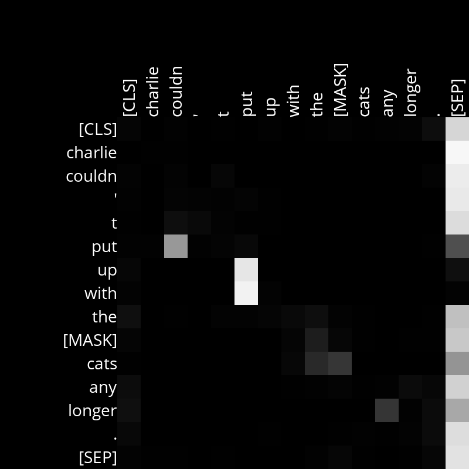
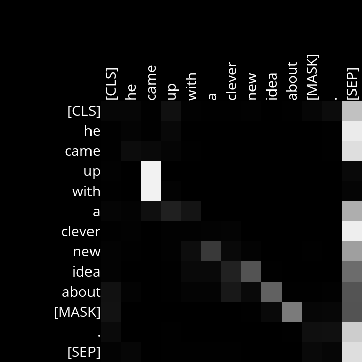
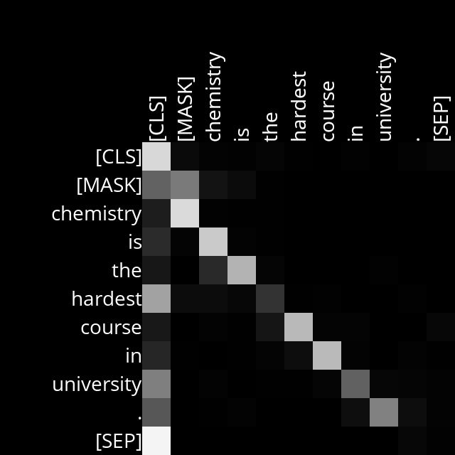
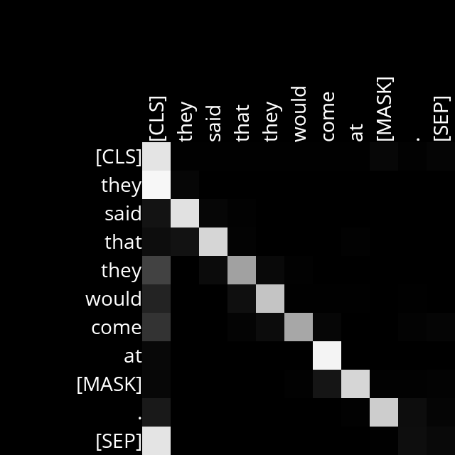

# Problem Set 61: Attention
### Introduction and objectives
This project involves using the BERT model to predict masked words in a sequence. It also aims to generate and visualize diagrams to represent attention scores of BERT's attention heads for the input sequences. These diagrams aim to provide insights into what the model's attention heads are focusing on during natural language processing.

The following functions were implemented:

1. "get_mask_token_index: Determines the index of the masked token within a given input sequence.
2. "get_color_for_attention_score": Generates a color representation for a given attention score. This function aids in the visualization process, ensuring that higher attention scores are visually distinguishable from lower scores.
3. "visualize_attentions": Constructs diagrams to display the attention values for an input sequence across all of BERT's attention heads.

### Results and Analysis
Upon completing those three functions, the mask.py program was set up to generate attention diagrams. These diagrams offer insights into how BERT discerns and concentrates on language. As an example, the attention diagram for Layer 6, Head 7 was observed while processing the sentence “Charlie couldn't put up with the [MASK] cats any longer.”.

In this example, the attention head shows a clear pattern: Layer 6 Head 7 seems to pay attention to common Transitive Phrasal Verbs. Other examples seem the show the same result, below is the same attention layer and head for the sentence "He came up with a clever new idea about [MASK]."

For the two sentences given, the diagram clearly links (put) <--> (up with) and (came) <--> (up with). Here's another case: look at the picture for Layer 2, Head 5. It was made while figuring out the word in the sentence "[MASK] chemistry is the toughest class at college."

In this situation, it seems this attention head has a straightforward way of working: each word is looking at the word right before it. For instance, the word "class" is closely linked to the word "toughest". This pattern can be seen with the other words in the sentence too. Somethin similar can be observed for the sentence "He said that he would come at [MASK].":

